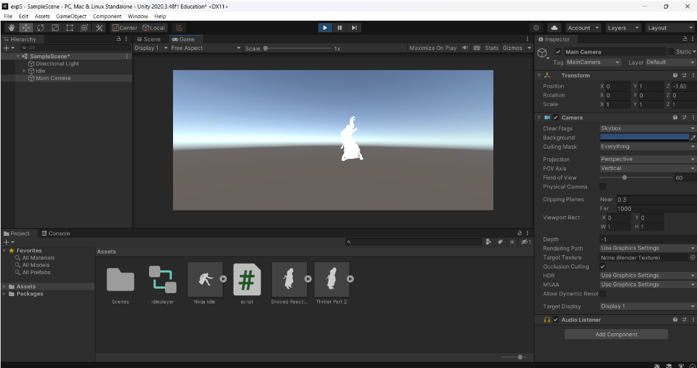

# Ex5-Animator-Movement
# Aim:
To develop a animator movement for a player using unity.

# Algorithm:
# Step 1:
Import necessary models.

#  2:
Right-click -> Create -> Animator Controller.

# Step 3:
Open Animator window, define states (Idle, Run, Jump, etc.).

# Step 4:
Use keyframes or Unity's Animation tools to animate transitions between states.

# Step 5:
Drag Animator Controller to the GameObject in the Inspector.

# Program:
```
PlayerController:

using System.Collections;
using System.Collections.Generic;
using UnityEngine;

public class script : MonoBehaviour
{
    public Animator animator;
    public float inx;
    public float iny;

    // Start is called before the first frame update
    void Start()
    {
        animator = this.gameObject.GetComponent<Animator>();
    }

    // Update is called once per frame
    void Update()
    {
        inx = Input.GetAxis("Horizontal");
        iny = Input.GetAxis("Vertical");
        animator.SetFloat("inx",inx);
        animator.SetFloat("inY",iny);
    }
}
```
# Output:

# Result:
An animator movement for a player using unity is developed successfully.